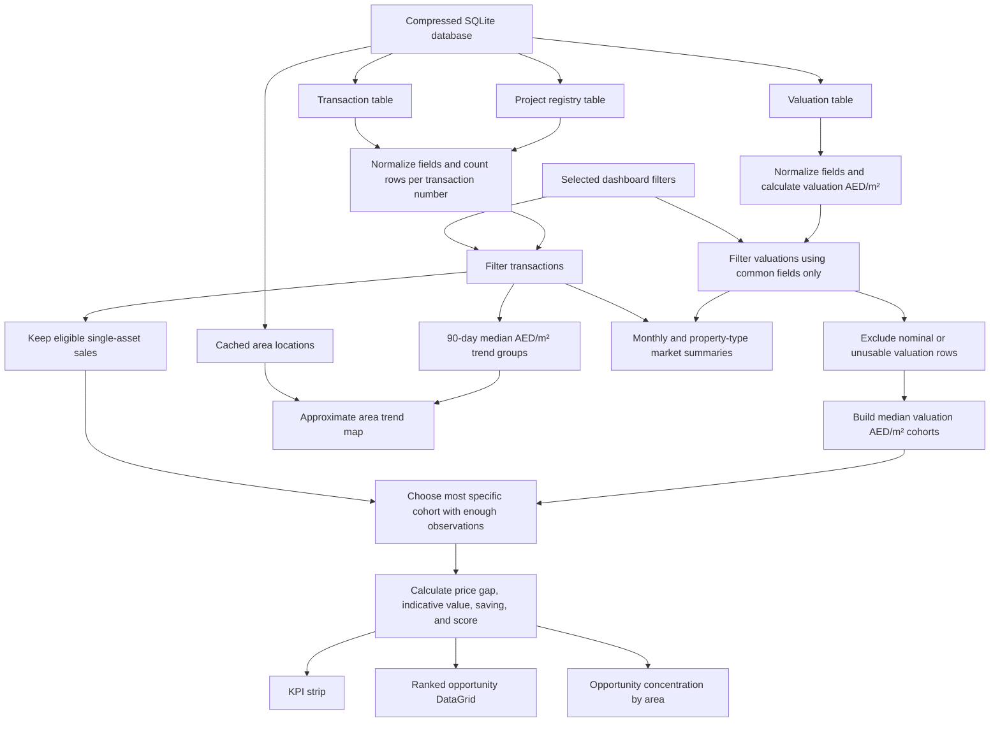

# Dashboard Data Flow and KPI Calculations

## 1. Executive summary

The transaction and valuation datasets do **not** contain a shared property identifier, parcel ID, unit ID, valuation ID, transaction ID, project ID, or other key that can support a defensible row-to-row join. The compressed SQLite package also contains a project registry and cached area centroids. These enrich transaction exploration but do not create a transaction-to-valuation relationship.

The dashboard therefore does **not** claim that a particular valuation record belongs to a particular transaction. It performs a **cohort comparison**:

1. Filter the transaction and valuation datasets.
2. Convert each usable valuation into AED per square metre.
3. Group valuations into market cohorts based on normalized location and property classification.
4. Calculate the median valuation AED/m² for each cohort.
5. Assign each eligible sale the most specific valuation cohort with a sufficient sample.
6. Compare the sale's AED/m² with that cohort's median valuation AED/m².

The resulting valuation gap is an investigative signal, not an appraisal and not proof that a sale and valuation refer to the same property.

## 2. Dataset relationship

### 2.1 Columns that can be mapped conceptually

| Purpose | Transactions file | Valuations file | How it is used |
|---|---|---|---|
| Record date | `INSTANCE_DATE` | `INSTANCE_DATE` | Date filtering and monthly aggregation only. It is not a row-level join. |
| Area/community | `AREA_EN` | `AREA_EN` | Normalized and used in the high- and medium-confidence cohort keys. |
| Property type | `PROP_TYPE_EN` | `PROPERTY_TYPE_EN` | Normalized and used in every benchmark cohort level. |
| Property subtype | `PROP_SB_TYPE_EN` | `PROP_SUB_TYPE_EN` | Normalized and used in the most specific and Dubai-wide subtype cohorts. |
| Property area | `ACTUAL_AREA` | `ACTUAL_AREA` | Used independently as the AED/m² denominator and for range filtering. It is **not** currently used as an exact join or size band. |
| Monetary amount | `TRANS_VALUE` | `ACTUAL_WORTH` | Converted independently into transaction AED/m² and valuation AED/m². The raw amounts are not joined. |

### 2.2 Columns that do not provide a cross-file link

- `TRANSACTION_NUMBER` exists only in the transaction file.
- `PROCEDURE_NUMBER` and `PROCEDURE_YEAR` in the valuation file are not treated as transaction identifiers.
- `PROJECT_EN` and `MASTER_PROJECT_EN` exist only in the transaction file.
- Rooms, parking, off-plan/ready status, freehold status, usage, metro, mall, and landmark data exist only in the transaction file.
- Neither file supplies coordinates, building age, floor, unit number, title deed number, parcel number, or a stable property ID.

Consequently, the dashboard cannot determine that valuation row `V` is the valuation of transaction row `T`.

### 2.3 Project registry linkage

The project registry supplies project number, developer, registration area, status, completion percentage, dates, value, and descriptive fields. Transactions are enriched only when normalized `PROJECT_EN` has exactly one registry match.

- Exact unique name: attach the registry project and developer metadata.
- Duplicate name: mark the transaction link as `Ambiguous` and do not assign a developer.
- Missing name: leave developer metadata unavailable.

This exact-name rule links 210 transaction project names in the current snapshot. It deliberately avoids fuzzy matching because similar marketing names can refer to different registered projects or developers.

## 3. End-to-end calculation flow



## 4. Normalization

### 4.1 Text keys

The cohort fields are normalized with:

```text
normalize(value) = trim(value).toLowerCase().replace(repeated whitespace, single space)
```

This makes values such as `BUSINESS BAY` and `Business Bay` comparable. It does not perform fuzzy matching, alias resolution, transliteration, typo correction, or geographic reconciliation.

The normalized fields are:

- `areaKey`
- `propertyTypeKey`
- `subTypeKey`

### 4.2 Numeric values

CSV source values are typed while the SQLite asset is built. Empty or invalid numeric values are stored as `NULL`; the React normalization layer converts them to `0` to preserve the KPI rules.

### 4.3 Transaction multiplicity

Rows are counted by `TRANSACTION_NUMBER`.

```text
assetCount = number of transaction CSV rows having the same TRANSACTION_NUMBER
```

Opportunity scoring requires `assetCount = 1`. This prevents a portfolio's total transaction value from being divided by one asset row's area. Multi-asset records remain visible in the transaction DataGrid.

## 5. Filter behavior

All analytics are recalculated after filters change.

### 5.1 Filters applied to both datasets

- Date range
- Area/community
- Property type
- Property subtype
- Minimum and maximum recorded value
  - Transactions: `TRANS_VALUE`
  - Valuations: `ACTUAL_WORTH`
- Minimum and maximum actual area

### 5.2 Transaction-only filters

- Transaction group
- Procedure
- Off-plan/ready status
- Freehold status
- Usage
- Rooms
- Developer
- Project
- Nearest metro
- Nearest mall
- Nearest landmark

Transaction-only filters cannot be applied to valuations because those columns do not exist in the valuation file. For example, selecting `Off-Plan` filters the candidate transactions but does not produce an off-plan-only valuation cohort.

## 6. Valuation benchmark construction

### 6.1 Eligible valuation rows

A valuation participates in benchmarks only when:

```text
ACTUAL_WORTH >= AED 1,000
ACTUAL_AREA > 0
ACTUAL_WORTH / ACTUAL_AREA > 0
```

The AED 1,000 threshold removes nominal rows such as valuations with a value of `1`. No percentile trimming, winsorization, inflation adjustment, or formal outlier removal is currently applied.

### 6.2 Valuation price per square metre

For each eligible valuation:

```text
valuationPsm = ACTUAL_WORTH / ACTUAL_AREA
```

### 6.3 Cohorts

Four lookup maps are built from the filtered valuations:

| Priority | Cohort key | Minimum sample | Confidence label |
|---:|---|---:|---|
| 1 | `AREA_EN + PROPERTY_TYPE_EN + PROP_SUB_TYPE_EN` | 3 | High |
| 2 | `AREA_EN + PROPERTY_TYPE_EN` | 3 | Medium |
| 3 | `PROPERTY_TYPE_EN + PROP_SUB_TYPE_EN` across Dubai | 10 | Exploratory |
| 4 | `PROPERTY_TYPE_EN` across Dubai | 20 | Exploratory |

For every cohort:

```text
benchmarkPsm = median(all eligible valuationPsm values in the cohort)
benchmarkSample = number of valuation records in the cohort
```

The dashboard selects the first cohort in the table that exists and meets its minimum sample size.

This is a fallback hierarchy, not a probabilistic model. A Dubai-wide fallback can make benchmark coverage appear high even when there is no area-specific valuation evidence.

## 7. Eligible transactions

A transaction can be compared with a valuation cohort only when:

```text
GROUP_EN = Sales
assetCount = 1
ACTUAL_AREA > 0
TRANS_VALUE >= AED 1,000
```

For every eligible sale:

```text
transactionPsm = TRANS_VALUE / ACTUAL_AREA
```

## 8. Per-transaction opportunity calculations

### 8.1 Indicative benchmark value

```text
benchmarkValue = benchmarkPsm * transaction ACTUAL_AREA
```

This applies a cohort median AED/m² to the transaction's recorded area. It is not the value from a specific valuation row.

### 8.2 Valuation gap percentage

```text
discountPct = ((benchmarkPsm - transactionPsm) / benchmarkPsm) * 100
```

Interpretation:

- Positive value: the recorded sale AED/m² is below the cohort valuation median.
- `15%`: the recorded sale AED/m² is 15% below the cohort valuation median.
- `0%`: the two AED/m² values are equal.
- Negative value: the recorded sale AED/m² is above the cohort valuation median.

### 8.3 Indicative monetary gap

```text
estimatedSaving = benchmarkValue - TRANS_VALUE
```

The UI calls this an indicative gap. It is not a guaranteed saving, realizable profit, or appraisal adjustment.

### 8.4 Opportunity score

The score ranks signals; it is not a probability of undervaluation.

Confidence weights:

```text
High        = 1.00
Medium      = 0.82
Exploratory = 0.58
```

Cohort-size weight:

```text
cohortWeight = min(1, log10(benchmarkSample + 1) / 1.7)
```

Weighted positive gap:

```text
weightedGap = max(0, discountPct) * confidenceWeight * cohortWeight
```

Final 0-100 score:

```text
opportunityScore = 100 * (1 - exp(-weightedGap / 45))
```

The exponential function prevents the score from growing linearly without limit. Negative valuation gaps receive a score of `0`.

## 9. KPI calculations

All KPIs use the currently filtered datasets.

| KPI | Calculation | Important qualification |
|---|---|---|
| Valuation-backed shortlist | Count of matched transactions where `discountPct >= 15` and confidence is `High` or `Medium` | Exploratory Dubai-wide fallback matches are excluded. |
| Aggregate indicative gap | Sum of `max(0, estimatedSaving)` over the same shortlisted transactions | This is not realizable profit and should not be interpreted as market value created. |
| Median discount | Median `discountPct` across the same shortlisted transactions | Uses only 15%+ High/Medium signals. |
| Valuation coverage | `matched eligible transactions / all eligible transactions * 100` | The numerator includes High, Medium, **and Exploratory** matches. It means cohort coverage, not direct property matching. |
| Recorded deal value | Sum of the first encountered `TRANS_VALUE` for each unique `TRANSACTION_NUMBER` in the filtered transaction rows | Deduplicates repeated transaction numbers. It does not sum every asset row. |
| Unique deals | Number of unique `TRANSACTION_NUMBER` values in the filtered transaction rows | A transaction can contain multiple asset rows. |
| Asset record count | Number of filtered transaction CSV rows | Calculated internally and used in record summaries. |
| Valuation count | Number of filtered valuation CSV rows | Includes nominal rows visible in the valuation explorer, even though nominal rows are excluded from benchmarks. |
| Median valuation AED/m² | Median of valuation `ACTUAL_WORTH / ACTUAL_AREA` where AED/m² is positive and `ACTUAL_WORTH >= 1,000` | Calculated across all filtered eligible valuations, not a specific transaction cohort. |

### Median definition

For sorted values:

- Odd count: the middle value.
- Even count: the average of the two middle values.
- Empty set: `0` internally, displayed through the normal KPI formatter.

## 10. Secondary chart and table calculations

### 10.1 Ranked opportunity DataGrid

The table displays matched single-asset sales where:

```text
discountPct > 0
```

It includes High, Medium, and Exploratory rows and sorts by `opportunityScore` descending. The evidence chip and benchmark cohort columns expose the comparison basis and sample size.

This means the table can contain more rows than the 15%+ High/Medium KPI shortlist.

### 10.2 Opportunity concentration by area

Input rows must have:

```text
discountPct > 0
confidence = High or Medium
```

For each area:

- `opportunities` = count where `discountPct >= 15`
- `medianDiscount` = median discount across all positive High/Medium gaps in the area
- `saving` = sum of positive indicative gaps across all positive High/Medium gaps in the area

Areas with at least one 15%+ opportunity are ranked by opportunity count, then median discount. Only the top 10 are shown.

### 10.3 Monthly price evidence

For each month:

- Transaction AED/m² = median sale `TRANS_VALUE / ACTUAL_AREA` for single-asset rows with positive area.
- Valuation AED/m² = median `ACTUAL_WORTH / ACTUAL_AREA` for valuations with positive AED/m² and `ACTUAL_WORTH >= 1,000`.
- Unique deals = distinct sale `TRANSACTION_NUMBER` count.
- Transaction value = sum of the first value encountered per distinct sale transaction number in that month.
- Valuation count = count of eligible valuation rows in that month.

The chart compares monthly aggregates. It does not pair monthly transaction rows with monthly valuation rows.

### 10.4 Property-type comparison

For each property type:

- Transaction AED/m² = median among single-asset sales with `ACTUAL_AREA > 0` and `TRANS_VALUE >= 1,000`.
- Valuation AED/m² = median among valuations with positive AED/m² and `ACTUAL_WORTH >= 1,000`.
- Deals = distinct sale transaction numbers.

Again, these are side-by-side cohort medians, not matched properties.

### 10.5 Price Trend Score

The Price Trend Score is calculated independently from the valuation Opportunity Index. Eligible trend rows are single-asset sales with recorded value of at least AED 1,000, positive actual area, and a valid date.

For each selected dimension (`Area`, `Developer`, `Project`, or `Property type`):

1. Anchor the comparison on the latest eligible filtered sale date.
2. Calculate median sale AED/m² for the latest 90 days.
3. Calculate the same median for the preceding 90 days.
4. Require at least five eligible sales in each period for a scored trend.
5. Combine absolute median change (60%), direction consistency across monthly medians (25%), and sample volume (15%).
6. Apply a confidence weight based on period samples and monthly consistency.

The result is signed from `-100` to `100`: positive is rising, negative is falling, and zero is stable within a two-percentage-point deadband. Rows with insufficient period samples remain visible as `Limited` but receive no score.

The Opportunity Index column in the trend table is the median of existing positive transaction-level Opportunity Index scores within that group. It is supporting context, not an input to the Price Trend Score.

### 10.6 Trend transaction evidence

The eye action on each trend row opens the eligible single-asset sales for that exact area, developer, project, or property-type group under the current dashboard filters. The dialog presents overall medians, a monthly median recorded-value line, the approximate area map, and a simplified paginated transaction table. It does not broaden the trend eligibility rule or mix valuation records into the transaction evidence.

### 10.7 Approximate area map

Area names are geocoded once during data preparation, cached locally, and packaged into the SQLite `area_locations` table. The browser never sends geocoding requests. Map bubbles represent approximate area centroids; their size reflects recent sales volume and their color reflects trend direction. They must not be interpreted as exact project, building, or unit coordinates.

## 11. Material limitations

1. **No direct property matching.** The dashboard cannot establish that a valuation belongs to a transaction.
2. **No project-level comparison.** Valuations have no project column, so a sale cannot be benchmarked against valuations from the same project.
3. **No room or unit matching.** Valuations have no bedroom, floor, unit, or parking information.
4. **No size bands.** AED/m² normalizes area, but the current cohort key does not distinguish small and large properties within the same area/type cohort.
5. **No nearest-date matching.** Dates limit the filtered evidence window; there is no time-decay weighting or nearest-valuation logic.
6. **No formal outlier treatment.** Medians reduce sensitivity to extremes, but the source values are not winsorized or validated against business rules beyond basic thresholds.
7. **Taxonomy differences remain.** Lowercasing and whitespace normalization do not reconcile semantic differences such as `Villa` versus `Residential / Villas`.
8. **Coverage can be misleading.** Dubai-wide property-type fallbacks can produce high coverage even when local valuation evidence is absent.
9. **Indicative gaps are not appraisal deltas.** Different properties within the same cohort can vary materially by age, condition, view, floor, developer, and exact location.
10. **Developer coverage is partial.** The registry snapshot covers 210 of 2,958 unique transaction project names. Unmatched and ambiguous projects remain unlinked.
11. **Map positions are approximate.** Source files do not contain coordinates. Cached area centroids provide geographic context only and can place multiple projects at the same point.

## 12. Recommended backend improvements

When the backend is introduced, the comparison should become more defensible by adding:

1. A canonical area and property taxonomy with alias mapping.
2. Size bands, such as quantile or business-defined area buckets.
3. Time windows or decay weighting so recent valuations contribute more strongly.
4. Project/building identifiers where an external source can enrich valuation records.
5. Separate models for off-plan and ready properties where enrichment permits it.
6. Robust outlier handling, data-quality flags, and configurable minimum sample sizes.
7. Benchmark provenance stored with each result: cohort key, date window, sample size, median, dispersion, and exclusions.
8. Dispersion measures such as median absolute deviation or interquartile range so confidence reflects cohort consistency, not only sample size.
9. A clear distinction between direct matches, enriched likely matches, local cohorts, and Dubai-wide fallbacks.

## 13. Implementation references

- SQLite packaging: `scripts/build_sqlite.py`
- One-time cached area geocoding: `scripts/geocode_areas.py`
- Browser-side SQLite loading and field normalization: `src/data/marketData.js`
- Filtering, cohort construction, Opportunity Index, Price Trend Score, KPIs, and chart summaries: `src/utils/marketAnalytics.js`
- KPI presentation: `src/components/kpis/KpiStrip.jsx`
- Ranked opportunity columns: `src/components/tables/OpportunityDataGrid.jsx`
- Trend ranking, evidence chart, and map: `src/components/trends/`
- View orchestration: `src/App.jsx`
